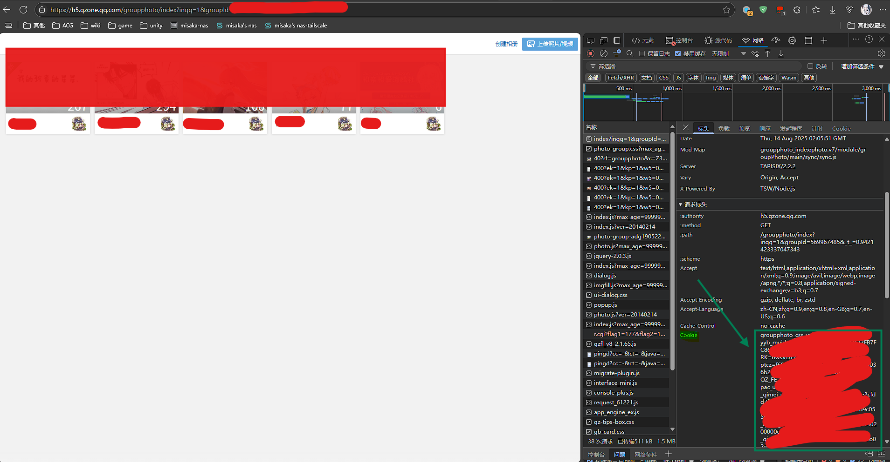
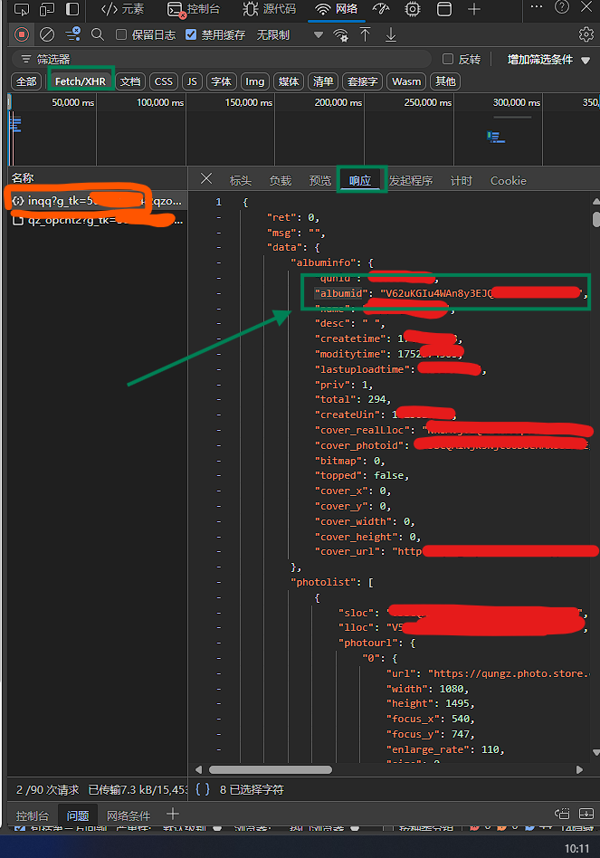

# oneday-onehoshino-downloader

一个不正经的qq群相册下载器

外加上一日一星野的下载器？！(将会使用ocr进行分类)

## 如何使用

普通群相册下载请确保将仓库下载下来解压之后运行`pip install requirements.txt`

然后再将`.env.sample`重命名为`.env`

最后配置成功后运行`python main.py`

其中下载文件会在程序根目录 `data` 文件夹中

## 配置文件

```dotenv
COOKIES= # 在要下载群相册中的自己的QQ的cookie
QUNID= # 要下载的群相册的群号
ALBUMID= # 要下载的群相册ID
QQNUM= # 在要下载群相册中的自己的qq号
TK= # TK

ALBUM_NAME= # 下载的群相册的文件夹名
HOSHINO= # 一日一星野开关，请输入 True 或者 False，默认关闭
```

## 相关配置获取

注意！因为qq的cookie保持时间可能就只有几个小时，所以`cookie`与`TK`建议在每次运行前重新获取一次

### cookie

请打开`https://h5.qzone.qq.com/groupphoto/index?inqq=1&groupId={需要下载的qq群的群号}`

并且登录已经入群的账号，并F12打开控制台

刷新页面之后在**网络**中随便点开一个请求在**表头**找到`cookie`复制里面的值即可



### ALBUMID

在完成上面的操作之后选择你需要下载的相册（请注意不要关闭控制台）

将筛选器选定为`Fetch/XHR`

选择前缀为`inqq`的链接并选择**响应**找到`albumid`



复制值即可

### TK

在上面操作中的链接中有`g_tk={数字}&....`

其中数字即是TK

## 一日一星野下载

当在某个群中的群相册下载到一日一星野后，其实会发现因为qq的原因导致无法恢复到上传之前的文件名

所以就需要借助ocr来识别经典的`D+{天数}~{页数}` 或 `D+{天数}(页数)`

但是需要注意！

**ocr识别并不准确，所以会导致一些正传图片也会被分类到Other中（以及D- 的内容）**

**以及正传内容也可能会识别出错**

**请自行进行重命名操作**

其中，从群相册直接下载下来的图片会放在`data/oneday-onehoshino`文件夹中

筛选出来的图片会放在`data/一日一星野`文件夹中

其中`data/一日一星野/Chapter`是识别出来的**正传内容**

其中`data/一日一星野/Other`是识别出来的**非正传内容**，也就是说未查找到`D+{天数}~{页数}` 或 `D+{天数}(页数)`都会丢到这里面

其中`data/一日一星野/Chapter`命名规则是`C{天数:4位数，不足补0}.jpg`，如果有页数的天数图则是`C{天数:4位数，不足补0}-P{天数:4页数，不足补0}.jpg`

### 如何开启

先运行 `pip install requirements.hoshino.txt`

再在.env文件中将`HOSHINO`更改为`True` `HOSHINO=True`

### 附加功能

在程序根目录运行`python -m functions.cbz_maker`即可自动将图片打包成cbz